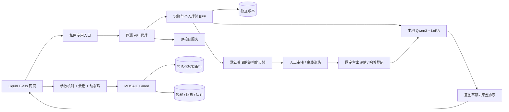

# 青财技术文档

## 1. 问题与场景

青年用户的收入、应急金、学费或租房押金往往被分散在记账、存钱和理财页面中。青财先把流水变为可校正的账本，再形成可编辑的个人计划；对话助手解释下一步，具体转账和产品本金操作进入独立确认流程。

比赛原型覆盖智能转账、账单分析和理财操作三个场景。转账支持已登记联系人的姓名、手机号和备注；账单支持分类、待核对金额、月/年可视化；理财支持风险偏好、产品比较、模拟申购与赎回。定时转账、AA、办卡、真实证券交易等会明确兜底。选择三类场景符合官网公布的最低场景数要求，不宣称完整覆盖各类所有子功能。[微众官方赛题](https://fintechathon.g-ican.com/#/)

## 2. 系统架构



保持原两个 FastAPI 服务和静态前端，新增服务端个人理财边界；两个后端共用一份本地模型。网页不直接访问模型或持有服务端密钥。所有银行本金变化经过同一个 MOSAIC `SafetyGateway` 和 `DurableBankLedger`。

## 3. 账本与导入

原账本完整保留；新版默认账本单独保存（合成演示数据）。人民币现金收支共 18 类：12 类支出、6 类收入。不是复式会计、资产负债表或多币种账本。用户手动、语音记录未覆盖。

CSV 支持 UTF-8 / GB18030，最多 500 行、1 MB。导入先预览，逐行校正日期、收支方向、金额、分类和资金性质；确认才整批提交。金额用 Decimal 校验为两位小数，内部资金操作用整数分。交易编号优先作为去重依据；没有编号时，以账户别名、标准化流水和同批出现序号形成精确重复指纹。原始 CSV 和未使用的账户/余额列不进入训练。

无编号的精确重复识别存在信息边界：缺少银行唯一流水号时，不能证明两条相同内容一定是同一经济事件；更换账户别名也会改变匹配范围。预览、重复计数和人工核对用于处理该边界。

导入成功后切换到个人账本。个人范围排除合成记录；首页、账本、报表、检索和个人计划使用同一范围。内部转账和申购/赎回本金保留为可见记录，但不计收入或消费。

退款在现金报告中作为流入单列；个人计划中抵减净支出，保留超过本月支出的退款流入。应急金按原支出与用户生活开销下限中较高值，加上未计入账单的月还款计算，避免一次退款降低预留需求。报告截至当前日期，不给未来日期填充已发生的零支出。

账单详情支持原 ID 编辑，来源与导入关联保留；使用行版本校验拒绝过期修改，并保留修改前快照。重复导入的内容冲突仍需核对，不追加相同流水。分类与搜索后的金额小计和条数单独显示，区间总览保持完整；六个月规划回源时显示真实起止日期。

多笔自然语言输入先明确要求逐笔核对，不再把一个合法 JSON 当成全部交易。当前仍为单笔草稿，不宣称批量自然语言入账。票据 OCR 没有启用，因此根据服务能力隐藏入口，保留手动和文字解析。

## 4. 画像与计划

投资入口按资金规划、投资研究、模拟持仓组织。规划首卡沿用账本所选月份，月均规划使用独立六个月窗口，两者可追溯到源账单。历史组合和模拟账户本金分别呈现，不互相累计。目标月度需求按扣除手动记录进度后的剩余金额计算，固定开销只补足与已记支出的差额；实际应急金已预留额未知。手动进度不会提高模拟交易额度。

生活阶段由用户选择，不从姓名、商户或聊天推断身份。计划使用最近六个完整日历月份中有记录的月份；覆盖数不等于银行流水完整性。至少三个有记录月份、有支出的月份不少于三个（或用户明确填写生活开销下限）、用户确认收支与还款完整、扣除额外开销和还款后为正、风险偏好完整，才开放长期方案参考。只有三笔工资不会被视为完整现金流；界面显示“待核对”，长期资格关闭。确认是用户声明，不等同银行核验；已有应急金的实际余额仍未知，不能将零缺失值展示成已满足。

风险偏好采用四题原型问卷。短期用款和不能承受损失会限制风险等级，不能被总分覆盖。这不是银行正式适当性评估。

```
应急金 = [max(月均原支出, 生活开销下限) + 未计入账单的月还款] × 预留月数
月均可安排 = max(0, 月均净结余 - 开销补差额 - 未计入账单的月还款)
目标预留 = 一年内目标全额；更长期目标先预留三期
长期可安排 = max(0, 现金 + 灵活产品本金 - 应急金 - 目标预留)
最终上限 = min(现金余额, 长期可安排)，再受数据和风险条件约束
```

目标每月需求超过结余时提示调整金额或期限。可记录的目标进度只是用户的进度记录，不能自动变成银行余额或持仓。旧储蓄目标需用户确认迁移；旧的预测储蓄值不会冒充已经存下的钱。

目标使用独立 ID，改名需明确选择延续原目标或创建新目标并归零；每次进度有请求 ID、时间与撤销状态，撤销幂等，旧目标请求不能写入新目标。期限追问用可信目标余额计算：旅行目标 12,000 元、已记录 3,000 元，从 12 个月测算为 6 个月，月预留从 750 元变为 1,500 元，原计划不自动改动。

两种体验产品呈现风险、用途、期限、流动性和费用；只移动本金，不制造收益。历史股票组合、研报和图表独立保留，不算入体验账户资产。

## 5. LLM 与可信事实

Qwen3-4B LoRA 做两类新任务：从上下文提取转账/申购/赎回意图，以及根据画像和账单汇总组织计划原因。缺金额或目标对象就追问；多笔、定时和超范围任务明确兜底。人民币是唯一体验币种，外币请求及尚未确认币种的追问不能自动转换成人民币草稿。

解释器只收到生活阶段、覆盖月份、现金流、预留和已核对原因 ID，不收到目标自由文本、交易描述、账户或验证码。输出只能选择已有原因、排列优先顺序和下一步页面。必须保留所有适用原因；新增金额、授权字段或越过优先条件会使结果失效，退回核对后的说明。网页中的实际金额由服务器事实生成。

记账助手继承当前月份/区间，请求附带明确起止日期，服务器仅查询当前账本范围内的收支与分类汇总。显式月份问题可切换区间；模型不能把所选 9 月替换为系统当前月。

投研读取历史行情时校验日期、有限正价格、非负成交量与 `low ≤ min(open, close) ≤ max(open, close) ≤ high`。异常行不进入图表或报告；原始 CSV 保留以便溯源。报告先生成带日期和来源的事实目录，模型只能选择目录 ID，不能自由添加数值、日期或收益判断；无法验证时使用事实摘要。成交量单位缺失，成交额与资金流向不推断；仅有研报标题时不推断公司基本面。数据校验不代表行情已被外部市场认证。

模型从不签发身份、用户确认、MFA 或已完成状态。模型意图不会写入银行；用户单独提交参数表，才创建待核对操作。资金执行前重新读取可信银行事实并再次判断可用资金。

## 6. 数据飞轮

默认关闭。用户选择加入后，改正模型草稿产生反馈候选；只保留操作类型、登记联系人别名、方案和金额区间。用户逐条审核；候选或舍弃记录不能训练。

离线导出从结构化槽位生成新的合成表述和合成金额，原始聊天、姓名、账号、精确金额、验证码均不导出。真实反馈只进入训练集，不随机分入评估。银行模板和汇总场景分组拆分；旧记账测试保持不变。

本轮端到端闭环包含一条经真实网页同意、修正、审核、导出的**隔离开发者演示反馈**。真实用户反馈为零；不能把演示样本称为用户采用量，不能把全部模型提升归因于这一条样本。

LoRA 由验证集损失选择轮次，完整生成测试之后执行发布门槛：银行意图与画像依据各至少 95%，旧记账能力不退步，且验证损失改善。未通过的 v3 候选保留失败记录，未部署。发布工具重算已保存的生成结果、检查数据与权重哈希；UI 与 LLM 无模型发布权限。

发布登记保留前版，回滚只改变模型配置，不修改账本和安全策略。真实审核反馈发布前复核同意及审核状态，训练记录标记所用版本。退出删除未训练反馈；已训练的影响需重新训练才能移除，不能承诺点击删除就消除模型记忆。

## 7. 执行与恢复

每笔操作绑定 actor、服务端会话、完整参数摘要和随机确认挑战。累计体验资金动作超过 1,000 元要求已注册的真实 TOTP；单笔最高 10,000 元。申购和赎回同样纳入每日资金操作阈值，不允许绕过。

相同会话请求 ID 和参数只执行一次。金额变化必须创建新核对；原动作不能在另一会话确认。取消只对未开始操作生效。执行结果未知时保留同一 handle，不自动重试或重新付款。

银行已提交而回执保存失败时，重启会恢复未完成预留并暂停后续资金动作。新会话可以读历史及查持久银行记录，不能继承旧确认。核账后用新挑战和动态码恢复后续操作，旧动作不会重发。银行无法确认的记录保持未知，需要人工处理。

## 8. 验证与边界

2026-10-04 根据评委式实测修复九类问题，验收矩阵见 [REVIEW-FIXES.md](REVIEW-FIXES.md)。本轮没有重训模型，仍使用实际部署的 finance-v4；修复落在能力检测、上下文、确定性计算、资料校验与交互。原模型合成开发留出成绩单独列为历史版本证据，不写成新一轮训练结果。

具体数量以生成的 `VALIDATION.json` 为准：区分应用回归、原安全包复现、模型固定留出、真实模型接口样例、浏览器验收。安全包复现有四项 Docker 可选测试未启用，该轮没有真实 LLM；不能从其测试数推导真实攻击成功率。

本原型使用私网 HTTP、单一固定 owner 和模拟资金；不具备真实银行登录、多租户、生产 HTTPS、外部密钥托管、完整法规认证和真实收益评估。方案价值是可验证的青年资金流程和独立于模型的执行边界，后续对接银行前仍需接入授权、隐私与适当性评审。
